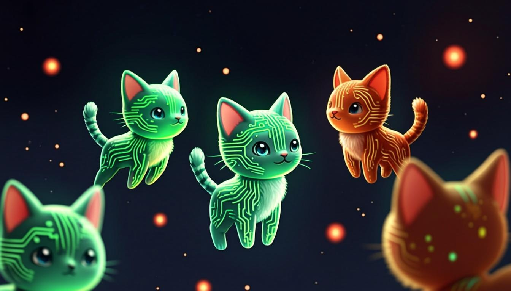

<div align="center">

# 🐾 ASCIICritters

**The Ultimate 3D Virtual Pet Creator**

[](https://github.com/smouj/asciicritters/stargazers)
[](LICENSE)
[](https://www.typescriptlang.org/)
[](https://nextjs.org/)
[](https://threejs.org/)
[](CONTRIBUTING.md)

[](https://github.com/smouj/asciicritters/actions)
[](https://github.com/smouj/asciicritters)
[](https://github.com/smouj/asciicritters/commits/main)
[](https://github.com/smouj/asciicritters/issues)

<p>
  <b>ASCII art pets rendered in stunning 3D</b> with bloom post-processing, 
  cinematic particles, AI-powered chat, and a dark cyberpunk UI.
</p>



<p>
  <a href="#-features">Features</a> •
  <a href="#-quick-start">Quick Start</a> •
  <a href="#-tech-stack">Tech Stack</a> •
  <a href="#-species">Species</a> •
  <a href="#-architecture">Architecture</a> •
  <a href="#-contributing">Contributing</a>
</p>

</div>

---

## ✨ Features

### 🎨 Stunning 3D Rendering
- **Canvas-based ASCII textures** — ASCII art rendered to canvas with glow/shadow, applied as 3D textures for perfect readability
- **Post-processing pipeline** — Bloom + Vignette for cinematic, neon-lit aesthetics
- **Dynamic lighting** — Intensity adapts to pet mood (bright when happy, dim when sad)
- **30 floating particles** — Octahedrons with mood-matching colors orbit your pet
- **Starfield background** — 600 procedural stars with fade and drift

### 🐾 12 Unique Species
Each with hand-crafted ASCII art, distinct color palettes, rarity levels, and AI personality profiles.

| Species | Rarity | Personality |
|---------|--------|-------------|
| 🦅 Phoenix | Legendary | Wise, poetic, dramatic |
| 🐉 Dragon | Epic | Proud, protective, formal |
| 🦄 Unicorn | Rare | Graceful, dreamy, kind |
| 🤖 Robot | Rare | Logical, helpful, data-driven |
| 🐺 Wolf | Uncommon | Stoic, loyal, observant |
| 🦉 Owl | Uncommon | Wise, thoughtful, nerdy |
| 🦊 Fox | Uncommon | Clever, witty, mischievous |
| 👻 Ghost | Uncommon | Mysterious, playful, spooky |
| 🐱 Neko | Common | Playful, curious, sassy |
| 🟢 Slime | Common | Bubbly, innocent, excitable |
| 🐢 Turtle | Common | Patient, calm, slow |
| 🐰 Bunny | Common | Hyperactive, adorable, giggly |

### 💬 AI-Powered Chat
- Talk to your pet using **LLM (z-ai-web-dev-sdk)**
- Responses are **character-driven** — each species has a unique personality
- Pet mood and stats influence dialogue naturally
- Conversations persist per session

### 🎮 6 Interactive Actions
- 🍖 **Feed** — Restore hunger (5 tokens)
- 🎮 **Play** — Boost happiness (8 tokens)
- 💪 **Train** — Gain XP & health (12 tokens)
- 💊 **Heal** — Restore health (6 tokens)
- 😴 **Rest** — Recharge energy (4 tokens)
- 🤗 **Pet** — Show affection (3 tokens)

### 📊 Session Analytics
- **Token tracking** — Every interaction costs tokens, visible in real-time
- **Action counter** — Track total interactions per session
- **XP & leveling** — 50 XP per level with progress bars
- **Mood system** — Ecstatic → Happy → Neutral → Sad → Critical

### 🖥️ Professional UI
- **Dark cyberpunk aesthetic** with 1px border radius throughout
- **3-column layout** — Pet list | 3D viewport | Info panel
- **Tabbed bottom panel** — Switch between Actions and Chat
- **Framer Motion animations** — Smooth transitions everywhere
- **Responsive design** — Works on desktop and mobile

---

## 🚀 Quick Start

### Prerequisites
- Node.js 18+ or Bun
- Git

### Installation

```bash
# Clone the repository
git clone https://github.com/smouj/asciicritters.git
cd asciicritters

# Install dependencies
bun install

# Set up database
bun run db:push

# Start development server
bun run dev
```

Open [http://localhost:3000](http://localhost:3000) to see your pets.

### Environment Variables

```env
# .env
DATABASE_URL="file:./db/custom.db"
```

---

## 🛠 Tech Stack

<div align="center">

| Category | Technology | Purpose |
|----------|-----------|---------|
| **Framework** |  | App Router, SSR, API routes |
| **Language** |  | Type safety |
| **3D Engine** |  | WebGL rendering |
| **React 3D** | @react-three/fiber + @react-three/drei | React bindings for Three.js |
| **Post-FX** | @react-three/postprocessing | Bloom, Vignette |
| **UI Library** | shadcn/ui + Radix | Component system |
| **Styling** |  | Utility-first CSS |
| **Animations** | Framer Motion | UI transitions |
| **Database** |  | ORM + SQLite |
| **AI Chat** | z-ai-web-dev-sdk | LLM pet conversations |
| **State** | Zustand + TanStack Query | Client + server state |

</div>

---

## 🏗 Architecture

```
asciicritters/
├── src/
│   ├── app/
│   │   ├── page.tsx              # Main UI (3-column layout)
│   │   ├── layout.tsx            # Root layout + fonts
│   │   ├── globals.css           # Dark theme + CSS variables
│   │   └── api/
│   │       ├── species/route.ts  # GET /api/species
│   │       └── pets/
│   │           ├── route.ts      # GET/POST /api/pets
│   │           └── [id]/
│   │               ├── route.ts       # GET/DELETE /api/pets/:id
│   │               ├── action/route.ts # POST /api/pets/:id/action
│   │               └── chat/route.ts   # POST/DELETE /api/pets/:id/chat
│   ├── components/
│   │   ├── pet/
│   │   │   └── ASCIIPetCanvas.tsx # Three.js 3D renderer
│   │   └── ui/                     # shadcn/ui components
│   └── lib/
│       ├── pets/
│       │   ├── types.ts           # Pet, Species, Chat interfaces
│       │   ├── species.ts         # 12 species definitions + ASCII art
│       │   ├── generator.ts       # Deterministic pet generation
│       │   ├── rng.ts             # Mulberry32 PRNG
│       │   └── index.ts           # Barrel exports
│       └── db.ts                  # Prisma client
├── prisma/
│   └── schema.prisma              # Pet + PetAction models
├── public/
│   └── og-image.png               # GitHub social preview
├── LICENSE                        # MIT
├── CONTRIBUTING.md
├── CODE_OF_CONDUCT.md
├── SECURITY.md
└── README.md
```

---

## 🎲 Deterministic Generation

Each pet is generated using a **Mulberry32** pseudo-random number generator seeded from the user ID. This means:

- The **same user always gets the same pet** for a given species
- Stats, rarity, and name are all reproducible
- No external randomness source needed
- Fair distribution with weighted rarity rolls

```typescript
// From src/lib/pets/rng.ts
function mulberry32(seed: number): () => number {
  return function () {
    let t = (seed += 0x6d2b79f5);
    t = Math.imul(t ^ (t >>> 15), t | 1);
    t ^= t + Math.imul(t ^ (t >>> 7), t | 61);
    return ((t ^ (t >>> 14)) >>> 0) / 4294967296;
  };
}
```

---

## 🐾 Species Gallery

<details>
<summary>🎨 Click to view all ASCII art</summary>

### Phoenix (Legendary)
```
         __          __
        /  \        /  \
       / .. \      / .. \
      /  /\  \    /  /\  \
     /  /  \  \  /  /  \  \
    /  /    \  \/  /    \  \
   /  /  /\   \    /\   \  \
  /  /  /  \       /  \   \  \
 /__/__/____\_____/____\___\
     \    \  |  |  /    /
      \____\ |  | /____/
            \|  |/
             |  |
            _|  |_
```

### Dragon (Epic)
```
              __====-_  _-====__
         _--^^^#####//      \\#####^^^--_
      _-^##########// (    ) \\##########^-_
    -############//  |\^^/|  \\############-
   /############//   (@::@)   \\############\
  /#############((     \\//     ))#############\
 /###############\\    (oo)    //###############\
 /################\\  / VV \  //################\
/###################\\      \\//###################\
```

### Neko (Common)
```
    /\_/\
   ( o.o )
    > ^ <
   /|   |\
  (_|   |_)
    "   "
```

</details>

---

## 📄 License

This project is licensed under the **MIT License** — see the [LICENSE](LICENSE) file for details.

---

## 🤝 Contributing

Contributions are welcome! Please read [CONTRIBUTING.md](CONTRIBUTING.md) for guidelines.

1. Fork the repository
2. Create your feature branch (`git checkout -b feature/amazing-pet`)
3. Commit your changes (`git commit -m 'Add new species: Octopus'`)
4. Push to the branch (`git push origin feature/amazing-pet`)
5. Open a Pull Request

---

## 🗺 Roadmap

- [ ] Multi-pet collection view
- [ ] Pet trading between users
- [ ] Animated ASCII art (frame sequences)
- [ ] Sound effects for actions
- [ ] Pet evolution/evolution system
- [ ] Achievement badges
- [ ] Leaderboard (highest level pets)
- [ ] Custom ASCII art upload
- [ ] Mobile native app (React Native)
- [ ] Multiplayer features (battles, trading)

---

<div align="center">

**Built with ❤️ by the ASCIICritters Team**

[⭐ Star us on GitHub](https://github.com/smouj/asciicritters/stargazers) · [🐛 Report a Bug](https://github.com/smouj/asciicritters/issues) · [💡 Request a Feature](https://github.com/smouj/asciicritters/issues)

</div>
